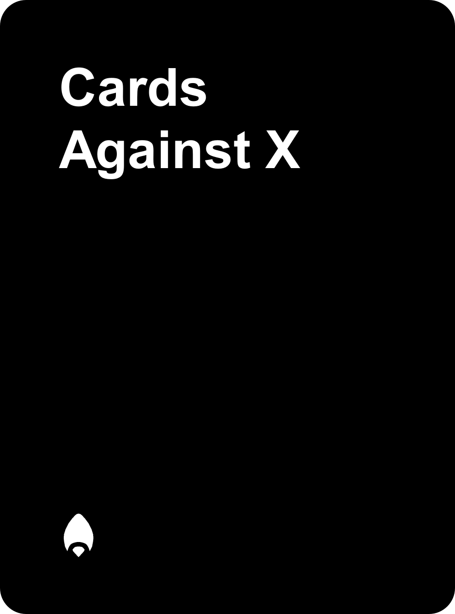
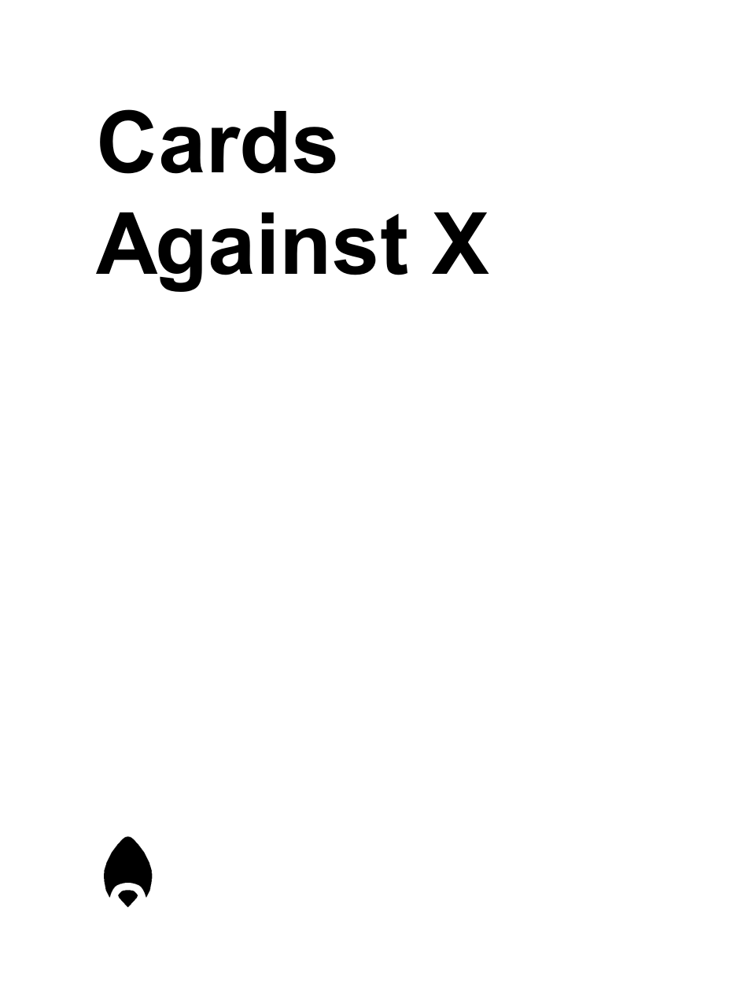
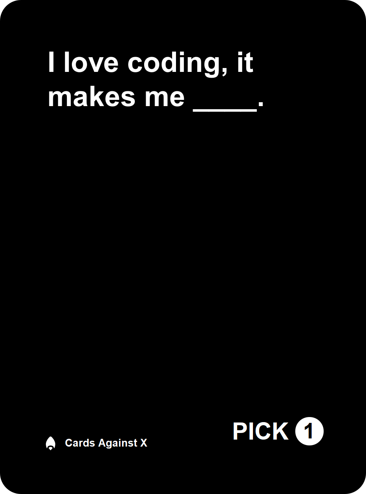
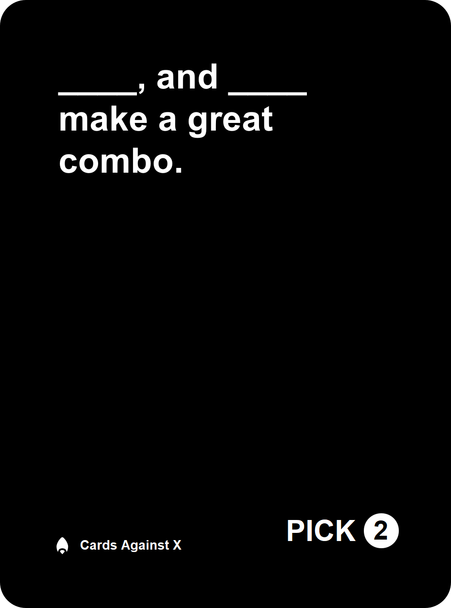
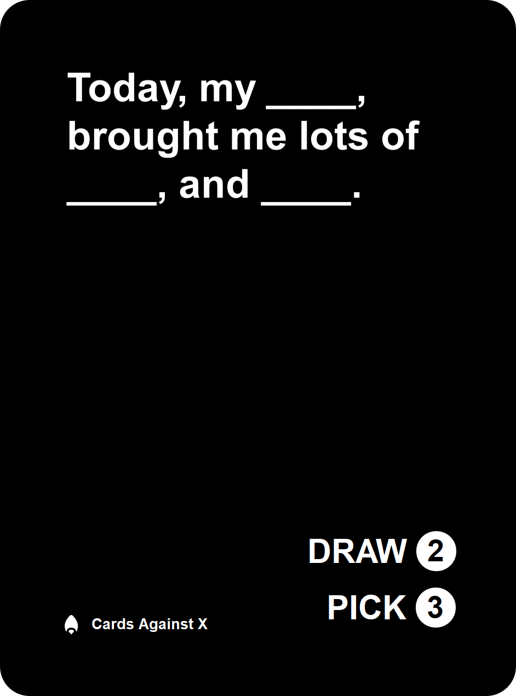
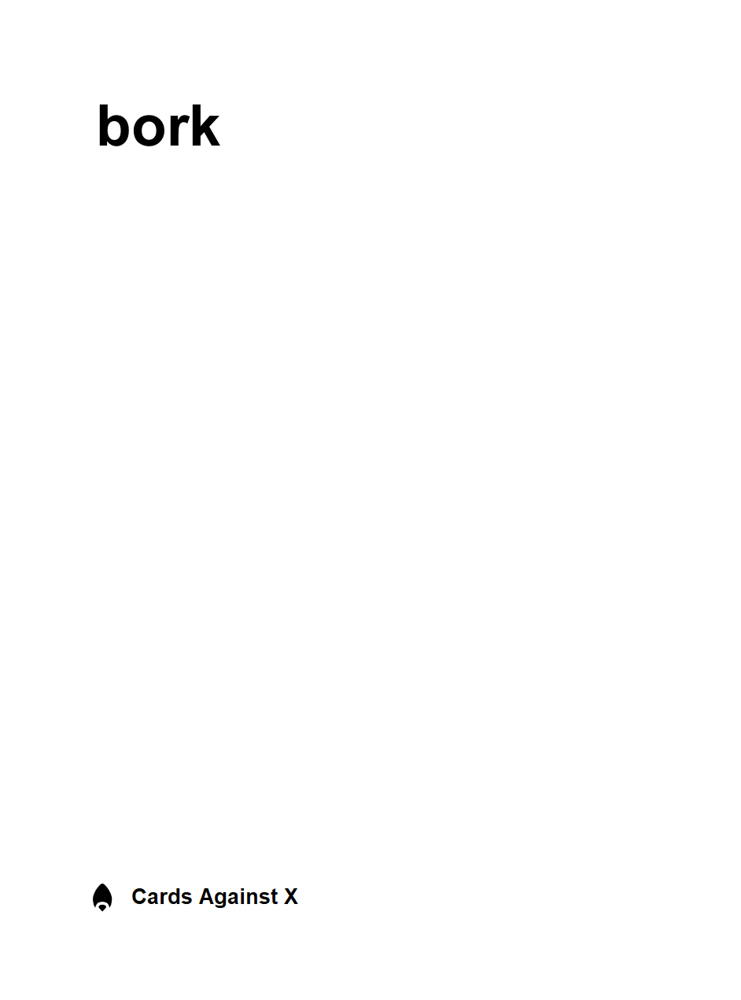

# Cards Against X

A template for themeing and rendering your own _Cards Against X_ cards for printing.

## Intent

-   Create separate word lists for black and white cards
-   Modify the HTML template to suit your needs
-   Run the render command
-   Create lots of individual card files as high resolution PNGs to submit for printing

## Samples

These are some sample renders at full print resolution (300 dpi); scaled down to fit visually. Additional padding has been added to create a safe printing area around the card text and icons.

| Back in Black | Back in White |
| - | - |
|  |  |

| Pick 1 | Pick 2 | Draw 2, Pick 3 |
| - | - | - |
|  |  |

| White |
| - |
|  |

## Key Concepts

This project is made up of the following components:

| Concept        | Description                                             |
| -------------- | ------------------------------------------------------- |
| Server         | Creates a local express web server to host HTML and CSS |
| Renderer       | Using phantomjs to render HTML/CSS into PNG files       |
| Card Templates | HTML and CSS files that represent cards to be rendered  |
| Word Lists     | Lits of words, separated by newline characters          |

## Supported Commands

### Setup

Before you begin; make sure you have **[node js](https://nodejs.org/en/)** and **[npm](https://www.npmjs.com/get-npm)** installed.

Checkout the source code for **cards-against-x** to your local machine; then from the same directory as **./package.json** run:

    npm install

This will install **phantomjs** for your operating system, express, and other libraries required to run the renderer.

### Local Hosting

Host the server for rendering cards:

    npm start

After starting the server, visit: <http://localhost:12500/card/black/0/> and <http://localhost:12500/card/white/0/> to see examples of templates that will be rendered.

These two pages share the same CSS from cards.css to present the same designs in different styles.

### Rendering

To run the **renderer** against the **card templates** using the **word lists**:

    npm run render

This will create a series of PNG files in the **./rendered/** folder inside the project.

## Milestones

These milestones highlight the current path of the project:

| :collision:        | Milestone                                                       |
| ------------------ | --------------------------------------------------------------- |
| :heavy_check_mark: | Create a basic HTML / CSS template                              |
| :heavy_check_mark: | Create a Github project                                         |
| :heavy_check_mark: | Create local hosting solution for previewing changes            |
| :heavy_check_mark: | Add phantomjs support to render template to PNG                 |
| :heavy_check_mark: | Feed template with data from text files                         |
| :heavy_check_mark: | Render multiple images using data from text files               |
| :heavy_check_mark: | Support multiple templates using data from different text files |
| :x:                | Add more template variables such as Card Brand and Icon         |
| :x:                | Support Pick 2 card types using separate word list              |

## More Info

This project is just getting started, raise an Issue within this github space to help us develop it.
